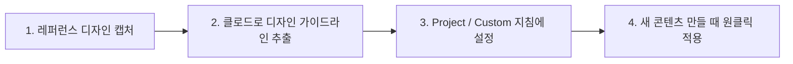

# 클로드 디자인 포맷 선택 및 자동 적용 가이드

마음에 드는 레퍼런스 디자인을 찾아 내 고유 스타일로 설정하고, 새로운 작업물에 일관된 톤앤매너로 신속하게 적용하는 완벽 워크플로우 가이드입니다.

---

## 📌 1. 전체 3단계 핵심 워크플로우



---

## 🔍 2. 1단계: 원하는 디자인 포맷 찾기 및 캡처

1. **디자인 레퍼런스 사이트 탐색:**
   - **카드뉴스 / SNS:** 인스타그램, Pinterest, 망고보드, 미리캔버스
   - **웹/앱 UI:** [Mobbin](https://mobbin.com), [Dribbble](https://dribbble.com), [shadcn/ui](https://ui.shadcn.com), Tailwind UI
2. 마음에 드는 디자인 화면을 **스크린샷(이미지)**으로 캡처하거나, HTML/CSS 코드가 있다면 코드를 복사합니다.

---

## 📝 3. 2단계: 클로드에게 '디자인 가이드라인'으로 추출시키기

캡처한 이미지를 클로드 대화창에 첨부하고, 아래 프롬프트를 입력하여 **디자인 규격서(가이드라인)**를 생성합니다.

### 💡 디자인 정밀 분석 프롬프트
```text
첨부한 이미지의 디자인 스타일과 포맷을 정밀 분석해줘.
다음 항목을 포함한 '재사용 가능한 디자인 가이드라인 (Markdown)'으로 정리해줘:

1. 색상 팔레트: 주 색상(Primary), 보조 색상(Secondary), 배경색, 텍스트 색상 (Hex 코드 포함)
2. 타이포그래피: 제목/본문 폰트 스타일, 크기 비율, 굵기, 행간
3. 레이아웃 & 구조: 여백(Padding/Margin), 카드 테두리 둥글기(Radius), 그림자(Shadow), 그리드 배치
4. 시각적 요소: 아이콘 스타일, 배지(Badge) 형태, 구분선 스타일
5. 톤앤매너: 전반적인 분위기 (예: 미니멀, 트렌디, 비즈니스 신뢰감 등)
```

---

## ⚙️ 4. 3단계: 클로드에 고정 설정(자산화)하기

추출된 가이드라인을 매번 붙여넣지 않고 **자동 적용**되도록 등록하는 2가지 방법입니다.

### 방법 A: Claude Projects (프로젝트 기능) 활용 *(추천)*
1. Claude 화면 좌측 메뉴에서 **Projects ➜ Create Project** 클릭.
2. 프로젝트 이름 설정 (예: `인스타 카드뉴스 제작소` 또는 `대시보드 UI`).
3. 우측 **Project Knowledge(프로젝트 지식)**에 추출한 가이드라인 마크다운 파일 등록.
4. **Custom Instructions(사용자 정의 지침)**에 기본 규칙 입력:
   > *"모든 산출물은 Project Knowledge에 등록된 디자인 가이드라인의 색상, 폰트, 레이아웃 규격을 엄격히 준수하여 React(Tailwind CSS) 또는 HTML/SVG로 제작해줘."*

### 방법 B: Claude Artifacts / React 템플릿 컴포넌트화 (JSX)
클로드에게 가이드라인을 바탕으로 뼈대 컴포넌트 생성을 요청:
> *"이 가이드라인을 반영한 5페이지짜리 기본 카드뉴스 React 템플릿(Artifacts) JSX 컴포넌트 코드를 작성해줘."*

---

## 🚀 5. 4단계: 실전 제작 및 무한 재활용

### 실전 제작 요청 프롬프트
```text
설정된 디자인 가이드라인 포맷을 적용해서,
'초보자를 위한 생성형 AI 프롬프트 작성 꿀팁 3가지'를 주제로 
5장짜리 카드뉴스 인터랙티브 UI(Artifact)를 만들어줘.

- 1페이지: 시선을 끄는 메인 표지
- 2~4페이지: 핵심 팁 3가지
- 5페이지: 요약 및 마무리(CTA)
```

### 내용(데이터)만 교체하여 새 카드뉴스 찍어내기
```text
방금 만든 이 JSX 템플릿의 디자인, 색상, 레이아웃 구조는 100% 그대로 유지하고,
슬라이드 내용(데이터)만 아래 주제로 바꿔서 새로 렌더링해줘:

[새로운 주제]: '초보자를 위한 옵시디언 마크다운 작성법 4단계'
```

---

## 🎨 6. 추천 확장 기능

1. **인터랙티브 슬라이더(캐러셀):**
   - 좌우 넘김 버튼과 페이지 번호 인디케이터 추가.
2. **원클릭 PNG 이미지 다운로드:**
   - `html2canvas` 등을 연동하여 완성된 카드를 이미지 파일로 즉시 저장.
3. **인스타그램 맞춤 비율:**
   - 1:1 정방형(1080x1080) 또는 4:5 세로형(1080x1350) 캔버스 비율 고정.
